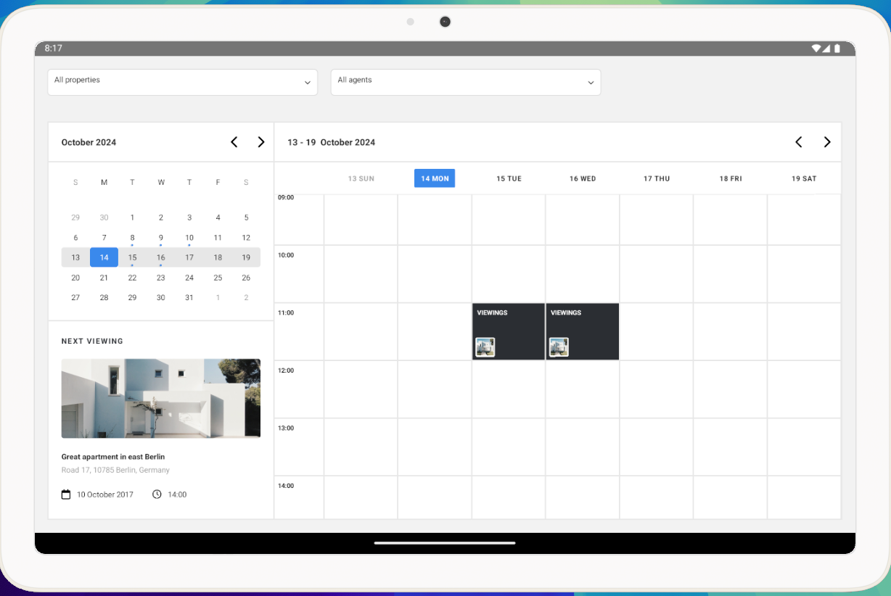
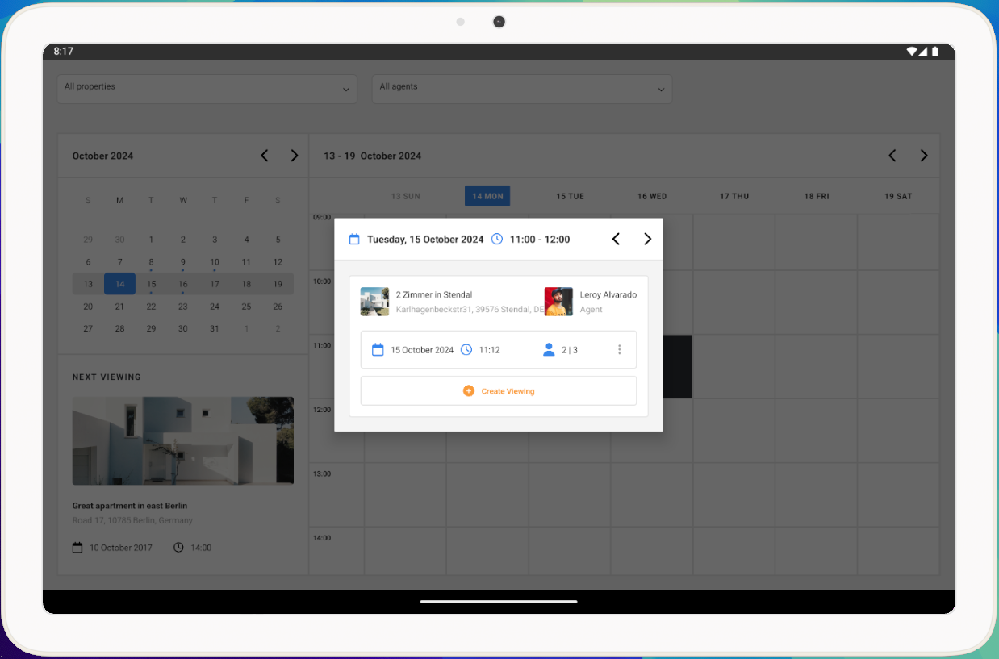

# ns-calendar-app
This calendar application was developed as part of a 48-hour technical challenge to demonstrate my proficiency with NativeScript and Angular. The app is designed specifically for iPad and enables users to manage and view property schedules with a clean and responsive UI.
## Key Technologies


- **NativeScript with Angular:** Framework for building native iOS and Android apps using Angular.
- **NgRx Store:** State management for efficiently handling app data and user interactions.

## Project Overview

The app provides an intuitive interface for scheduling property viewings, showing detailed information about each viewing, and allowing users to manage viewings in a simple calendar layout. 

The application was developed within a 48-hour timeframe, with a focus on delivering both functionality and a polished UI.


## Screenshots


*Home view*


*Property Listng Meeting View*


## How to Run the Project


**Clone the repository**

```bash
git clone https://github.com/mohamedkuch/ns-calender-app.git
```
    
**Navigate to the project directory:**

```bash
cd ns-calender-app
```
    
**Install the dependencies:**

```bash
npm install
```
    

**Run the project:**

- For **iOS**, you will need **Xcode** installed and configured. Use an iOS simulator or connect an iPad.

- For **Android**, you will need **Android Studio** installed with an emulator or connect an Android device.
## Notes

- The app is optimized for **iPad-sized screens**Ï Smaller screens like iPhones are not supported, as the design was specifically tailored for large displays.


